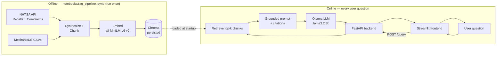
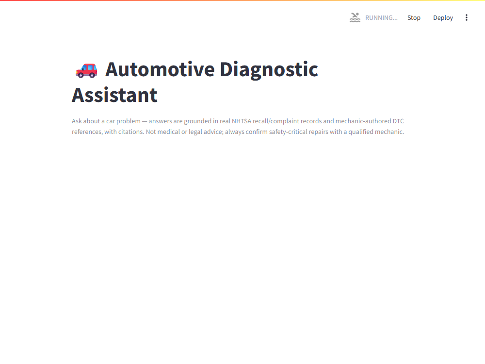
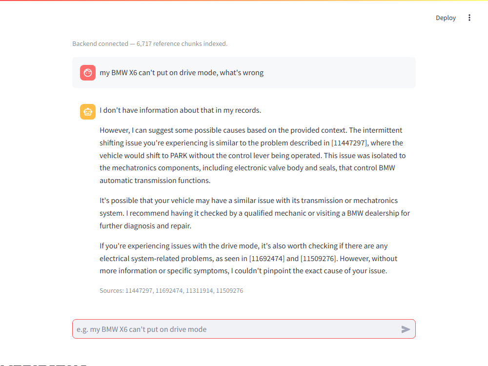

# Automotive Diagnostic RAG Assistant

Ask a car problem in plain language — *"my BMW X6 can't put on drive mode"* — and get back a grounded, cited answer built from real NHTSA recall/complaint records and mechanic-authored diagnostic references, not from the LLM's own memorized knowledge.

**Core Track** — text-only RAG (no CV/YOLO component).

## Overview

| | |
|---|---|
| **Domain** | Automotive diagnostics (symptom → probable cause → repair → parts affected) |
| **Data** | NHTSA Recalls + Complaints (live public API, public domain) and MechanicDB's public OBD-II DTC sample (ODbL v1.0) |
| **Retrieval** | Chroma vector store, `all-MiniLM-L6-v2` embeddings |
| **Generation** | Local Ollama (`llama3.2:3b`), grounded prompt with citation |
| **Backend** | FastAPI |
| **Frontend** | Streamlit |

## Architecture



## Tech Stack

- **Notebook / data:** Python 3.11, pandas, `langchain-core` / `langchain-text-splitters` / `langchain-huggingface` / `langchain-chroma`, `sentence-transformers`, `chromadb`
- **LLM:** Ollama (`llama3.2:3b`), via `langchain-ollama`
- **Backend:** FastAPI, Uvicorn, Pydantic / pydantic-settings, pytest
- **Frontend:** Streamlit
- **Data sources:** NHTSA `api.nhtsa.gov` (Recalls + Complaints), MechanicDB public sample (GitHub)

## Project Structure

```
rag-assistant-project/
├── notebooks/
│   └── rag_pipeline.ipynb        # Phases 2.1-2.7: load, chunk, embed, retrieve, evaluate, export
├── scripts/
│   └── fetch_nhtsa_data.py       # Phase 1: one-time NHTSA API pull -> data/raw/nhtsa/
├── data/
│   ├── raw/
│   │   ├── nhtsa/                # gitignored (65MB, 288 files) -- regenerate via the fetch script
│   │   └── mechanicdb/           # committed (~500KB) -- includes MechanicDB's own LICENSE
│   ├── vector_store/              # gitignored -- regenerate by running the notebook
│   └── eval_results.csv          # gitignored -- produced by notebook Section 2.6
├── backend/
│   ├── app/
│   │   ├── main.py               # FastAPI app, CORS, startup loading
│   │   ├── api/routes/query.py   # GET /health, POST /query
│   │   ├── core/config.py        # Settings from .env
│   │   ├── schemas/query.py      # QueryRequest / QueryResponse
│   │   ├── services/
│   │   │   ├── retrieval.py      # Loads the persisted vector store, retrieves chunks
│   │   │   └── generation.py     # Grounded prompt + Ollama call
│   │   └── utils/logging_config.py
│   ├── tests/test_query.py
│   ├── requirements.txt
│   ├── .env.example
│   └── Dockerfile
└── frontend/
    ├── app.py                    # Streamlit chat UI
    ├── api_client.py              # Backend API wrapper (URL from env var, never hard-coded)
    ├── .env.example
    └── requirements.txt
```

## Domain & Data

Three sources, chosen and verified deliberately (see `notebooks/rag_pipeline.ipynb` Section 2.1/2.2 for the full reasoning):

1. **NHTSA Recalls** (`api.nhtsa.gov/recalls`) — official manufacturer safety recalls: problem summary, consequence, and remedy. **Public domain.**
2. **NHTSA Complaints** (`api.nhtsa.gov/complaints`) — real owner-submitted problem narratives, in the natural, unstructured language an actual user types. **Public domain.** Capped at 25 sampled complaints per (make, model, year) at corpus-build time — popular models generate tens of thousands of raw complaints each, most near-duplicates of the same handful of recurring issues.
3. **MechanicDB public sample** (`github.com/MechanicDB/MechanicDB-public`) — 89 OBD-II diagnostic trouble codes with mechanic-authored technical explanations, ranked repair procedures, and parts. **License: ODbL v1.0** (attribution + share-alike — see `data/raw/mechanicdb/LICENSE`, kept in the repo alongside the data).

**Obtaining the raw NHTSA data** (excluded from git — 65MB, freely re-fetchable):
```bash
cd rag-assistant-project
python scripts/fetch_nhtsa_data.py
```
This calls NHTSA's free public API (no key required) for a fixed scope of 20 popular make/model combinations across model years 2016–2023, and saves the raw JSON responses to `data/raw/nhtsa/`. Takes a few minutes.

## Setup

### Prerequisites
- Python 3.10+
- [Ollama](https://ollama.com) installed and running, with the model pulled:
  ```bash
  ollama pull llama3.2:3b
  ```
- Git

### 1. Data collection + notebook (run once)
```bash
cd rag-assistant-project
pip install -r backend/requirements.txt   # covers the notebook's dependencies too
python scripts/fetch_nhtsa_data.py
jupyter nbconvert --to notebook --execute --inplace notebooks/rag_pipeline.ipynb
```
This produces the persisted vector store at `data/vector_store/`. **Expect ~3–4 minutes for embedding ~6,700 chunks and ~45–50 seconds per LLM generation call on CPU** — not a hang.

Then copy it into the backend (this is the "copied from your notebook" step — the backend loads its own local copy, not the project-root one, so it stays self-contained/deployable on its own):
```bash
mkdir -p backend/data/vector_store
cp -r data/vector_store/. backend/data/vector_store/
```
> ⚠️ If `backend/data/vector_store/` already exists (e.g. from a previous failed run — Chroma auto-creates an empty directory there the moment `RetrievalService` first tries to open it), delete it first (`rm -rf backend/data/vector_store`) before copying, or `cp -r` will nest the real data one level too deep inside it instead of replacing it.

### 2. Backend
```bash
cd backend
python -m venv .venv && source .venv/bin/activate   # .venv\Scripts\activate on Windows
pip install -r requirements.txt
cp .env.example .env
uvicorn app.main:app --reload
```
Verify at `http://localhost:8000/docs`.

### 3. Frontend
```bash
cd frontend
pip install -r requirements.txt
cp .env.example .env
streamlit run app.py
```
Verify at `http://localhost:8501`.

## Environment Variables

**backend/.env**

| Variable | Default | Description |
|---|---|---|
| `VECTOR_STORE_DIR` | `data/vector_store` | Where the notebook persisted the Chroma store |
| `VECTOR_STORE_COLLECTION` | `automotive_diagnostics` | Chroma collection name |
| `EMBEDDING_MODEL` | `sentence-transformers/all-MiniLM-L6-v2` | Must match the notebook's embedding model |
| `OLLAMA_MODEL` | `llama3.2:3b` | Local LLM used for generation |
| `OLLAMA_BASE_URL` | `http://localhost:11434` | Ollama server address (use `http://host.docker.internal:11434` if the backend runs in Docker and Ollama runs on the host) |
| `CORS_ALLOW_ORIGINS` | `http://localhost:8501` | Comma-separated frontend origin(s) |
| `RETRIEVAL_K` | `4` | How many chunks to retrieve per query |

**frontend/.env**

| Variable | Default | Description |
|---|---|---|
| `API_BASE_URL` | `http://localhost:8000` | Backend base URL — never hard-coded in `app.py`/`api_client.py` |

## API Reference

### `GET /health`
```bash
curl http://localhost:8000/health
```
```json
{"status": "ok", "chunks_indexed": 6795}
```

### `POST /query`
```bash
curl -X POST http://localhost:8000/query \
  -H "Content-Type: application/json" \
  -d '{"question": "my BMW X6 cant put on drive mode"}'
```
```json
{
  "answer": "...",
  "sources": ["11447297", "11692474", "11311914", "11509276"]
}
```
A `question` that is missing or empty returns `422 Unprocessable Entity` (validated by `QueryRequest`, `min_length=1`).

## Evaluation Results

See `notebooks/rag_pipeline.ipynb` Section 2.6 for the full table (10 test questions, retrieved sources, and answers) and `data/eval_results.csv` for the raw output.

**Real findings from actually running the pipeline** (not hypothesized in advance — see Section 2.6 for full detail, including how each was diagnosed):

1. **A real chunking bug was found and fixed.** Joining every field with a single `\n` and splitting that string caused `RecursiveCharacterTextSplitter` to orphan short header lines ("DTC Code: X (Category)") into their own nearly-empty chunks whenever the next field exceeded `chunk_size` alone — confirmed directly on a real record. **Fixed** by splitting only the body text and re-attaching the header to every resulting chunk; re-verified that every retrieved chunk now carries real diagnostic content.
2. **Exact-identifier retrieval still misses, even after the fix — a genuine embedding limitation, not the chunking bug.** A query for DTC `P0011` retrieved different, wrong codes each run (`P1100`, `P0325`, `U0100`) — never the correct one, though it's confirmed present in the corpus. Same lesson as the Day 2 `SEC-104` lab: dense embeddings encode meaning, and a short alphanumeric code carries almost none. Mitigation (not implemented, scoped as future work): hybrid BM25 + dense search.
3. **A side-effect of fixing #1: the model stopped hallucinating from its own training data.** Before the fix, the LLM answered the P0011 question *correctly* — but using its own memorized knowledge, not the (badly polluted) retrieved context, and said so explicitly. After the fix, faced with the same kind of irrelevant context, it correctly said "I don't have information about that in my records" instead. Fixing chunk quality improved grounding discipline as a bonus.
4. **Small-model hedging is inconsistent.** `llama3.2:3b` sometimes opens with "I don't have information about that" and then still uses and correctly cites the retrieved context anyway (not a hallucination — the citations are real); other times, the same opening phrase is followed by nothing further. Which behavior occurs isn't fully predictable question-to-question.
5. **Duplicate recall campaigns across model years** — the same NHTSA campaign number (e.g. `17V652000`) appears as a separate chunk for each model year it covers, since Phase 1 queries per (make, model, year) and a single recall often spans several years. Redundant, not incorrect.

## Screenshots

Backend + frontend running together, real end-to-end flow (question → API → retrieval → `llama3.2:3b` → grounded, cited answer):




## Known Limitations

- Complaints corpus is a fixed sample (first 25 per vehicle), not the full ~58K raw complaints collected — a deliberate scope decision (see Section 2.1/2.2), not an oversight.
- No hybrid (BM25 + dense) search yet — recommended next step for exact-identifier queries (DTC codes, recall campaign numbers).
- CPU-only inference: ~45–50s per generated answer on this hardware.
