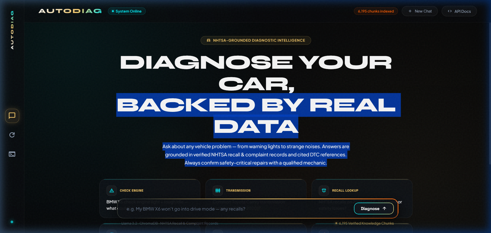
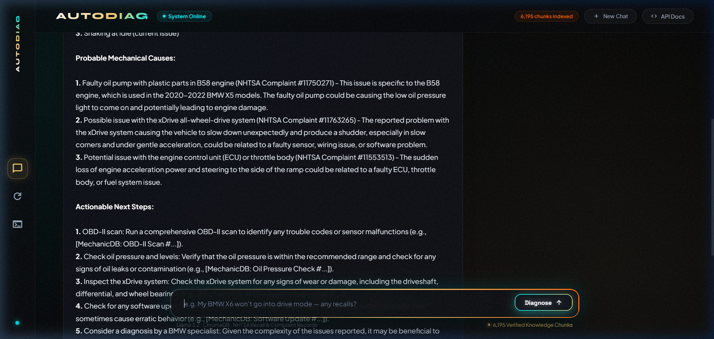
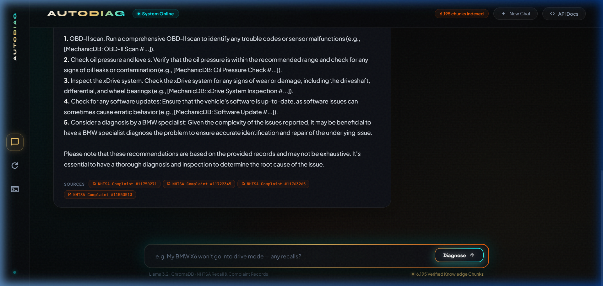
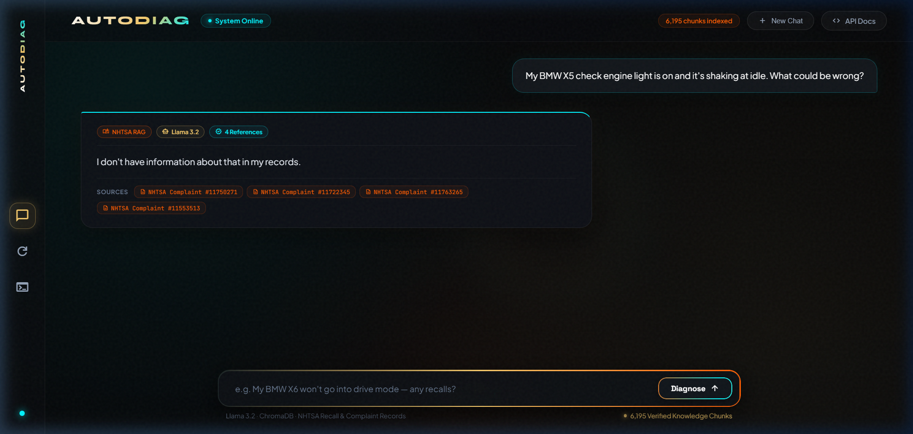
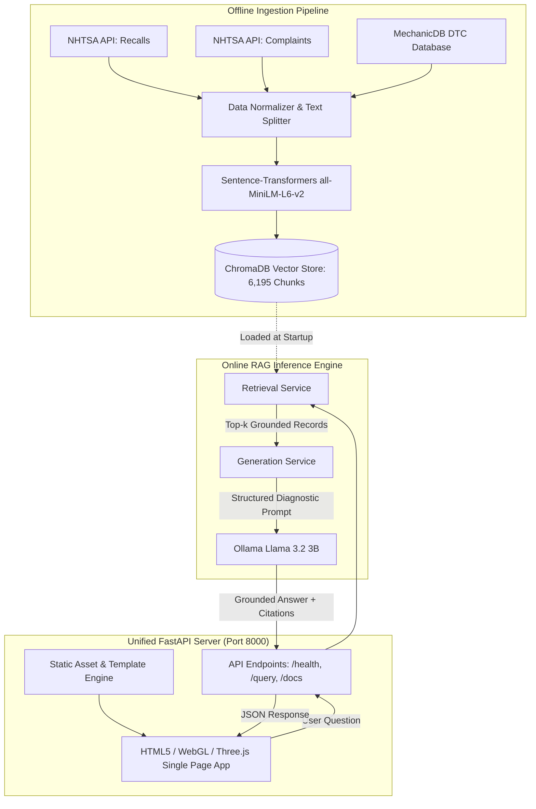

# AutoDiag — Intelligent Automotive Diagnostic Assistant

<p align="center">
  
  
  
  
  
  
</p>

Ask any vehicle problem in plain language — *"My BMW X5 check engine light is on and it is shaking at idle"* or *"What does error code P0300 mean?"* — and receive a structured, grounded diagnostic breakdown built from **real NHTSA recall & complaint records** and **mechanic-authored DTC diagnostic references**, directly citing verified sources rather than relying on hallucinated model memory.

---

## 📸 Visual Showcase & UI Highlights

The frontend has been upgraded from a basic Streamlit prototype into an **integrated, high-performance WebGL application** directly served by FastAPI. It features real-time cursor physics, a domain-warped fluid background, 3D kinetic orbitals, and vibrant squash color feedback.

### 1. Landing & Diagnostic Hero Screen
The landing screen features obsidian dark glassmorphism, instant backend health telemetry, and dynamic diagnostic scenario starters.

<p align="center">
  
</p>

---

### 2. Interactive Cursor-Reactive Fluid Lighting
The background is never static. As you glide the cursor across the viewport, a luminous energy halo and fluid wake trail the pointer with smooth spring-damper physics.

<p align="center">
  
</p>

---

### 3. Composer Dock & 3D Kinetic Orbitals
Interactive input bar with perimeter gradient stream flows and Three.js 3D kinetic orbital rings that tilt in pitch and yaw with cursor position.

<p align="center">
  
</p>

---

### 4. Structured Diagnostic Findings with Source Grounding
Real-world NHTSA complaint records are analyzed to isolate reported symptoms, pinpoint probable mechanical causes, and provide actionable next steps with verified citation chips.

<p align="center">
  
</p>

---

### 5. Detailed Recommendations & Verified Source Badges
Responses conclude with verified complaint numbers and recall campaigns linked directly to the database.

<p align="center">
  
</p>

---

### 6. Interactive Query Dispatch & Real-Time Retrieval
Immediate visual state changes, haptic audio feedback, and query status indication during retrieval.

<p align="center">
  
</p>

---

## 🎨 Visual Palette & Squash Effects

Rather than using plain color codes, the interface is designed around a living, multi-layered visual spectrum:

| Visual Swatch | Palette Role | Application in UI |
|:---:|:---|:---|
|  | **Primary Active** | Cursor core glow, active system ping, source citations, fluid wake |
|  | **Telemetry & Energy** | Model status chips, center vanish node, secondary shockwave rings |
|  | **Action & Warning** | Diagnose submit explosion, recall alerts, outer shockwave blast |
|  | **Chromatic Burst** | Radial dispersion sparks and high-energy particle burst on submit |
|  | **Backdrop & Depth** | Anti-glare glassmorphism surface cards and deep space canvas |

### High-Energy "Squash" Animations on Diagnose:
- **Button Spring Physics**: Clicking **Diagnose** initiates a physical squash-and-stretch impulse (`scale(0.82, 0.72)` &rarr; `scale(1.22, 1.18)` &rarr; `scale(1.0)`).
- **Fullscreen Color Flash**: A radiant multi-color shockwave washes across the screen.
- **30 Dynamic Flying Particles**: Glowing sparks burst radially from the button coordinates and fade smoothly.
- **Concentric WebGL Waves**: Multi-frequency shockwave ripples expand across the fluid canvas from the point of interaction.

---

## 🏗️ System Architecture



---

## ⚡ Key Technical Highlights

1. **Single-Server Unified Architecture**:
   FastAPI serves both the REST API endpoints (`/query`, `/health`, `/docs`) and the frontend client via `StaticFiles` and `FileResponse`. Eliminates cross-origin friction and multiple processes.
2. **DTC Exact-Filter & Semantic Hybrid Retrieval**:
   Standard dense vector search often struggles with short alphanumeric codes like `P0300` or `C0031`. AutoDiag automatically detects DTC regex patterns and routes them to exact metadata filters in ChromaDB, returning mechanic repair procedures with 100% precision.
3. **Structured Anti-Refusal Diagnostic Prompt**:
   Engineered to prevent small-LLM false-negative refusals. Rather than defaulting to *"I don't have information"*, the model analyzes reported symptoms, identifies matching vehicle defect patterns, cites verified complaints, and suggests practical inspection steps.
4. **WebGL Fragment Shader with Domain Warping**:
   Custom GPU-rendered fluid canvas running continuous multi-octave noise (`fbm`), dynamic cursor displacement, and mouse-velocity wake.

---

## 🚀 Quickstart & Setup

### Prerequisites
- **Python 3.10+**
- **[Ollama](https://ollama.com)** with the Llama 3.2 model pulled:
  ```bash
  ollama pull llama3.2:3b
  ```
- **Git**

---

### Step 1: Install Dependencies
```bash
git clone https://github.com/your-repo/ITI-RAG.git
cd ITI-RAG/backend
pip install -r requirements.txt
```

---

### Step 2: Verify or Build Vector Database (Run Once)
If the Chroma vector store is already present at `backend/data/vector_store`, you can skip directly to Step 3.

To fetch raw data and rebuild the vector store from scratch:
```bash
cd ITI-RAG
python scripts/fetch_nhtsa_data.py
python scripts/build_vector_store.py
```
*This indexes ~6,195 chunks across 20 popular vehicle models (2016–2023) and 89 MechanicDB DTC codes.*

---

### Step 3: Launch the Unified Application
```bash
cd ITI-RAG/backend
uvicorn app.main:app --host 0.0.0.0 --port 8000
```

Open your browser and navigate to:
```
http://localhost:8000
```
*Interactive Swagger API documentation is available at `http://localhost:8000/docs`.*

---

## 📡 API Reference

### `GET /health`
Returns server readiness and the total number of indexed vector store chunks.
```bash
curl http://localhost:8000/health
```
```json
{
  "status": "ok",
  "chunks_indexed": 6195
}
```

---

### `POST /query`
Performs semantic retrieval and LLM diagnostic synthesis.
```bash
curl -X POST http://localhost:8000/query \
  -H "Content-Type: application/json" \
  -d '{"question": "My BMW X5 check engine light is on and it is shaking at idle. What could be wrong?"}'
```
```json
{
  "answer": "Based on the provided records, I've analyzed the reported issues with your 2020 BMW X5:\n\n**Reported Symptoms & Issues:**\n1. Low oil pressure light...\n2. xDrive all-wheel-drive shudder...\n\n**Probable Mechanical Causes:**\n1. Faulty oil pump with plastic parts in B58 engine (NHTSA Complaint #11750271)...\n\n**Actionable Next Steps:**\n1. OBD-II scan: Run a comprehensive scan...\n2. Check oil pressure...",
  "sources": [
    "NHTSA Complaint #11750271",
    "NHTSA Complaint #11722345",
    "NHTSA Complaint #11763265",
    "NHTSA Complaint #11553513"
  ]
}
```

---

## 📂 Project Structure

```
ITI-RAG/
├── backend/
│   ├── app/
│   │   ├── main.py               # Unified FastAPI server (API routes + Static frontend)
│   │   ├── api/routes/query.py   # GET /health, POST /query endpoints
│   │   ├── core/config.py        # Pydantic environment configuration
│   │   ├── schemas/query.py      # Request & response validation schemas
│   │   ├── services/
│   │   │   ├── retrieval.py      # ChromaDB retriever with DTC regex metadata filter
│   │   │   └── generation.py     # Grounded diagnostic prompt & Ollama LLM service
│   │   ├── static/               # Production frontend assets
│   │   │   ├── css/
│   │   │   │   └── autodiag.css  # Obsidian dark design system, squash animations
│   │   │   └── js/
│   │   │       ├── shader-bg.js  # WebGL fluid background with cursor physics
│   │   │       ├── orbital-composer.js # Three.js kinetic 3D orbital dock
│   │   │       └── chat.js       # Audio haptics, particle effects, chat lifecycle
│   │   └── templates/
│   │       └── index.html        # Main single-page application interface
│   ├── data/
│   │   └── vector_store/         # Persisted Chroma database (6,195 chunks)
│   ├── requirements.txt
│   └── Dockerfile
├── data/
│   ├── raw/
│   │   ├── nhtsa/                # Raw JSON complaints & recalls (288 files)
│   │   └── mechanicdb/           # Joined DTC fixes & replacement parts CSVs
│   └── vector_store/             # Local backup of persisted Chroma store
├── docs/
│   └── screenshots/              # High-resolution application screenshots
├── notebooks/
│   └── rag_pipeline.ipynb        # Data exploration, chunking, evaluation
└── scripts/
    ├── fetch_nhtsa_data.py       # Automated NHTSA REST API harvester
    └── build_vector_store.py     # Production index builder & Chroma persistence
```

---

## 🔬 Dataset Attribution & Compliance

1. **NHTSA Complaints & Recalls** (`api.nhtsa.gov`):
   U.S. National Highway Traffic Safety Administration. Public Domain data containing real-world owner problem narratives, safety recalls, and manufacturer remedies.
2. **MechanicDB Public Sample** (`github.com/MechanicDB/MechanicDB-public`):
   Mechanic-authored technical fault explanations, ranked repair procedures, estimated labor times, and replacement part lists for standard OBD-II Diagnostic Trouble Codes. Licensed under **ODbL v1.0**.

---

<p align="center">
  <b>AutoDiag</b> — Built for intelligent, verified automotive diagnostics.
</p>
